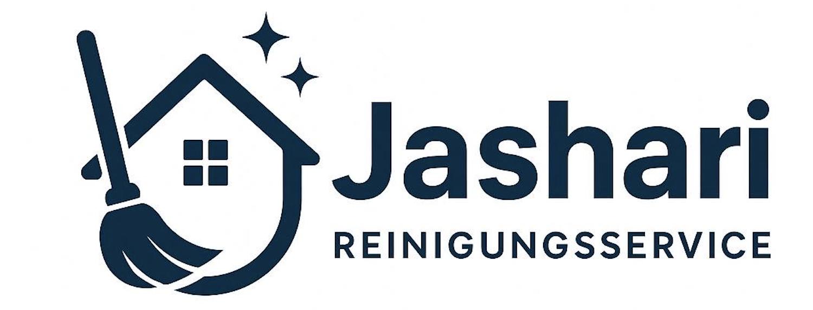

<!DOCTYPE html>
<html lang="de">
<head>
    <meta charset="UTF-8">
5    <meta name="viewport" content="width=device-width, initial-scale=1.0">
6    <title>ReinigungsService Jashari - Professionelle Reinigung in Gelsenkirchen</title>
7    <link rel="icon" type="image/x-icon" href="favicon.ico">
8    <link rel="shortcut icon" type="image/x-icon" href="favicon.ico">
9    <link rel="apple-touch-icon" href="favicon.ico">
10    <link rel="preconnect" href="https://fonts.googleapis.com">
11    <link rel="preconnect" href="https://fonts.gstatic.com" crossorigin>
12    <link href="https://fonts.googleapis.com/css2?family=Poppins:wght@300;400;500;600;700;800&display=swap" rel="stylesheet">
    
</head>
<body>
    <!-- Cookie Banner -->
    

        

            

                <h2>Cookie-Richtlinie</h2>
                <button class="cookie-close" onclick="closeCookieBanner()">&times;</button>
            

            

                
Diese Website verwendet Cookies. Weitere Informationen zu den Cookie-Arten finden sich unter den jeweiligen Kategorien. Dort lassen sich auch einzelne Cookies aktivieren. Die Cookie-Einstellungen können jederzeit über den Link im Footer dieser Website angepasst werden.

                
                

                    

                        <a href="#impressum" onclick="showLegalPage('impressum'); closeCookieBanner();">Impressum</a>
                        <a href="#datenschutz" onclick="showLegalPage('datenschutz'); closeCookieBanner();">Datenschutz</a>
                    

                

                

                    

                        Unbedingt erforderlich
                        

                    

                

                

                    <button class="cookie-btn cookie-btn-primary" onclick="acceptAllCookies()">Alle akzeptieren</button>
                    <button class="cookie-btn cookie-btn-secondary" onclick="rejectAllCookies()">Alle ablehnen</button>
                    <button class="cookie-btn cookie-btn-tertiary" onclick="acceptSelectedCookies()">Nur Auswahl akzeptieren</button>
                

            

        

    

    <!-- Navigation -->
    <nav>
        

            
            <ul>
                <li><a href="#home">Start</a></li>
                <li><a href="#services">Dienstleistungen</a></li>
                <li><a href="#gallery">Galerie</a></li>
                <li><a href="#about">Über uns</a></li>
                <li><a href="#testimonials">Bewertungen</a></li>
                <li><a href="#contact">Kontakt</a></li>
            </ul>
        

    </nav>

    <!-- Hero Section -->
    <section id="home" class="hero">
        

            <h1>ReinigungsService Jashari</h1>
            
„Wir reinigen gründlich, zuverlässig und mit Herz."

            

                <a href="tel:+4916363212685" class="btn btn-primary">📞 Jetzt anrufen</a>
                <a href="#contact" class="btn btn-secondary">📧 Angebot anfragen</a>
            

        

    </section>

    <!-- Services Section -->
    <section id="services" class="services">
        

            <h2 class="section-title">Unsere Dienstleistungen</h2>
            
Professionelle Reinigungslösungen für jeden Bedarf

            

                

                    
🏢

                    <h3>Büroreinigung</h3>
                    
Professionelle Reinigung Ihrer Geschäftsräume für ein sauberes und produktives Arbeitsumfeld. Flexibel nach Ihren Anforderungen – täglich, wöchentlich oder monatlich.

                

                

                    
🏠

                    <h3>Haushaltsreinigung</h3>
                    
Gründliche Reinigung Ihres Zuhauses, damit Sie mehr Zeit für die wichtigen Dinge im Leben haben. Wir kümmern uns um alles – von Küche bis Badezimmer.

                

                

                    
✨

                    <h3>Grundreinigung</h3>
                    
Intensive Tiefenreinigung für Neueinzug, Auszug oder einfach für einen kompletten Neustart Ihrer Räumlichkeiten. Wir erreichen auch schwer zugängliche Stellen.

                

                

                    
🪟

                    <h3>Fensterreinigung</h3>
                    
Streifenfreie, kristallklare Fenster für optimalen Lichteinfall und perfekte Aussicht. Auch für schwer erreichbare Fenster und Fassaden.

                

                

                    
🏗️

                    <h3>Baureinigung</h3>
                    
Professionelle Endreinigung nach Bau- oder Renovierungsarbeiten. Wir entfernen Baustaub, Farbreste und hinterlassen alles blitzsauber.

                

                

                    
🏥

                    <h3>Praxisreinigung</h3>
                    
Hygienische Reinigung für Arztpraxen, Kanzleien und andere sensible Bereiche nach höchsten Standards. Diskretion garantiert.

                

            

        

    </section>

    <!-- Gallery Section -->
    <section id="gallery" class="gallery">
        

            <h2 class="section-title">Unsere Arbeit</h2>
            
Einblicke in unsere professionelle Reinigungsarbeit

            

                

                    
                    

                        <h3>Büroreinigung</h3>
                        
Saubere Arbeitsplätze für produktive Teams

                    

                

                

                    
                    

                        <h3>Fensterreinigung</h3>
                        
Kristallklare Fenster ohne Streifen

                    

                

                

                    
                    

                        <h3>Haushaltsreinigung</h3>
                        
Ihr Zuhause in besten Händen

                    

                

                

                    
                    

                        <h3>Küchenreinigung</h3>
                        
Hygiene wo sie am wichtigsten ist

                    

                

                

                    
                    

                        <h3>Badreinigung</h3>
                        
Sanitäre Anlagen perfekt gereinigt

                    

                

                

                    
                    

                        <h3>Wohnräume</h3>
                        
Gemütlichkeit trifft Sauberkeit

                    

                

            

        

    </section>

    <!-- About Section -->
    <section id="about" class="about">
        

            

                

                    <h2 class="section-title">Warum ReinigungsService Jashari?</h2>
                    
Mit langjähriger Erfahrung und einem Team von qualifizierten, geschulten Fachkräften bieten wir professionelle Reinigungsdienstleistungen in Gelsenkirchen und der gesamten Umgebung an.

                    
Unser Anspruch ist es, nicht nur sauber zu machen, sondern Ihre Räume zum Strahlen zu bringen. Mit modernsten Reinigungsmethoden, umweltfreundlichen Produkten und einem Auge fürs Detail sorgen wir dafür, dass Sie sich in Ihren Räumen rundum wohlfühlen.

                    
Ihre Zufriedenheit ist unser Erfolg – deshalb arbeiten wir jeden Tag mit Leidenschaft und Herzblut.

                

                

                    

                        
✓

                        

                            <h3>Zuverlässigkeit</h3>
                            
Pünktlich, verlässlich und immer für Sie da. Wir halten unsere Termine ein und stehen zu unserem Wort.

                        

                    

                    

                        
✓

                        

                            <h3>Höchste Qualität</h3>
                            
Perfektionistische Standards bei jedem Auftrag. Wir arbeiten nicht nach Checkliste, sondern nach Ergebnis.

                        

                    

                    

                        
✓

                        

                            <h3>Faire Preise</h3>
                            
Transparente Kostenstruktur ohne versteckte Gebühren. Sie wissen immer genau, wofür Sie bezahlen.

                        

                    

                    

                        
✓

                        

                            <h3>Umweltfreundlich</h3>
                            
Einsatz ökologischer Reinigungsmittel für Ihre Gesundheit und unsere Umwelt.

                        

                    

                

            

        

    </section>

    <!-- Testimonials Section -->
    <section id="testimonials" class="testimonials">
        

            <h2 class="section-title">Was unsere Kunden sagen</h2>
            
Echte Bewertungen von zufriedenen Kunden

            

                

                    
★★★★★

                    
"Absolut professioneller Service! Das Team war pünktlich, gründlich und sehr freundlich. Unser Büro war noch nie so sauber. Wir haben einen langfristigen Vertrag abgeschlossen und sind mehr als zufrieden!"

                    

                        
MS

                        

                            <h4>Michael Schmidt</h4>
                            
Geschäftsführer, Tech GmbH

                        

                    

                

                

                    
★★★★★

                    
"Nach unserem Umzug haben wir ReinigungsService Jashari für die Grundreinigung beauftragt. Das Ergebnis hat unsere Erwartungen übertroffen! Jede Ecke war blitzsauber. Absolut empfehlenswert!"

                    

                        
SK

                        

                            <h4>Sarah Klein</h4>
                            
Privatkundin, Gelsenkirchen

                        

                    

                

                

                    
★★★★★

                    
"Zuverlässig, sauber, freundlich – was will man mehr? Die regelmäßige Reinigung unserer Praxis klappt einwandfrei. Das Team arbeitet diskret und professionell. Vielen Dank für die tolle Arbeit!"

                    

                        
DM

                        

                            <h4>Dr. med. Müller</h4>
                            
Arztpraxis, Essen

                        

                    

                

            

        

    </section>

    <!-- Contact Section -->
    <section id="contact" class="contact">
        

            <h2 class="section-title">Kontaktieren Sie uns</h2>
            
Wir freuen uns auf Ihre Anfrage!

            

                

                    

                        
📞

                        

                            <h3>Telefon</h3>
                            <a href="tel:+4916363212685">+49 163 6321268</a>
                            
Montag - Freitag: 8:00 - 18:00 Uhr Samstag: 9:00 - 14:00 Uhr Sonntag: Nach Vereinbarung

                        

                    

                    

                        
📧

                        

                            <h3>E-Mail</h3>
                            <a href="mailto:samimjasari@gmail.com">samimjasari@gmail.com</a>
                            
Wir antworten innerhalb von 24 Stunden

                        

                    

                    

                        
📍

                        

                            <h3>Einsatzgebiet</h3>
                            
<strong>Gelsenkirchen und Umgebung</strong> 
                        

                    

                

                

                    <h3 style="margin-bottom: 1.5rem; color: #1e293b; font-size: 1.5rem;">Kostenloses Angebot anfragen</h3>
                    <form action="mailto:samimjasari@gmail.com" method="POST" enctype="text/plain">
                        

                            <label for="name">Ihr Name *</label>
                            <input type="text" id="name" name="name" required placeholder="Max Mustermann">
                        

                        

                            <label for="email">E-Mail Adresse *</label>
                            <input type="email" id="email" name="email" required placeholder="ihre@email.de">
                        

                        

                            <label for="phone">Telefonnummer</label>
                            <input type="tel" id="phone" name="phone" placeholder="+49 123 456789">
                        

                        

                            <label for="message">Ihre Nachricht *</label>
                            <textarea id="message" name="message" required placeholder="Beschreiben Sie bitte Ihr Anliegen... Welche Art von Reinigung benötigen Sie? Wie groß ist die Fläche?"></textarea>
                        

                        <button type="submit" class="btn btn-primary" style="width: 100%;">📧 Nachricht senden</button>
                    </form>
                

            

        

    </section>

    <!-- Impressum Page -->
    <section id="impressum" class="legal-page">
        

            

                <a href="#home" class="back-link" onclick="hideLegalPage()">← Zurück zur Startseite</a>
                <h1>Impressum</h1>
                
                <h2>Angaben gemäß § 5 TMG</h2>
                

                    <strong>ReinigungsService Jashari</strong> 
                    Inhaber: Samim Jashari 
                    Gelsenkirchen, Deutschland
                

                <h2>Kontakt</h2>
                

                    Telefon: <a href="tel:+4916363212685">+49 163 6321268</a> 
                    E-Mail: <a href="mailto:samimjasari@gmail.com">samimjasari@gmail.com</a>
                

                

                <h2>Berufsbezeichnung und berufsrechtliche Regelungen</h2>
                

                    Berufsbezeichnung: Reinigungsdienstleistungen 
                    Zuständige Kammer: Handwerkskammer Münster  
                    Betriebsnummer: 42069019  
                    Verliehen in: Deutschland
                

                <h2>Verbraucherstreitbeilegung / Universalschlichtungsstelle</h2>
                

                    Wir sind nicht bereit oder verpflichtet, an Streitbeilegungsverfahren vor einer Verbraucherschlichtungsstelle teilzunehmen.
                

                <h2>Haftung für Inhalte</h2>
                

                    Als Diensteanbieter sind wir gemäß § 7 Abs.1 TMG für eigene Inhalte auf diesen Seiten nach den allgemeinen Gesetzen verantwortlich. Nach §§ 8 bis 10 TMG sind wir als Diensteanbieter jedoch nicht verpflichtet, übermittelte oder gespeicherte fremde Informationen zu überwachen oder nach Umständen zu forschen, die auf eine rechtswidrige Tätigkeit hinweisen.
                

                

                    Verpflichtungen zur Entfernung oder Sperrung der Nutzung von Informationen nach den allgemeinen Gesetzen bleiben hiervon unberührt. Eine diesbezügliche Haftung ist jedoch erst ab dem Zeitpunkt der Kenntnis einer konkreten Rechtsverletzung möglich. Bei Bekanntwerden von entsprechenden Rechtsverletzungen werden wir diese Inhalte umgehend entfernen.
                

                <h2>Haftung für Links</h2>
                

                    Unser Angebot enthält Links zu externen Websites Dritter, auf deren Inhalte wir keinen Einfluss haben. Deshalb können wir für diese fremden Inhalte auch keine Gewähr übernehmen. Für die Inhalte der verlinkten Seiten ist stets der jeweilige Anbieter oder Betreiber der Seiten verantwortlich. Die verlinkten Seiten wurden zum Zeitpunkt der Verlinkung auf mögliche Rechtsverstöße überprüft. Rechtswidrige Inhalte waren zum Zeitpunkt der Verlinkung nicht erkennbar.
                

                <h2>Urheberrecht</h2>
                

                    Die durch die Seitenbetreiber erstellten Inhalte und Werke auf diesen Seiten unterliegen dem deutschen Urheberrecht. Die Vervielfältigung, Bearbeitung, Verbreitung und jede Art der Verwertung außerhalb der Grenzen des Urheberrechtes bedürfen der schriftlichen Zustimmung des jeweiligen Autors bzw. Erstellers. Downloads und Kopien dieser Seite sind nur für den privaten, nicht kommerziellen Gebrauch gestattet.
                

            

        

    </section>

    <!-- AGB Page -->
    <section id="agb" class="legal-page">
        

            

                <a href="#home" class="back-link" onclick="hideLegalPage()">← Zurück zur Startseite</a>
                <h1>Allgemeine Geschäftsbedingungen (AGB)</h1>
                
                <h2>1. Geltungsbereich</h2>
                

                    Diese Allgemeinen Geschäftsbedingungen gelten für alle Verträge zwischen ReinigungsService Jashari (nachfolgend "Auftragnehmer") und dem Kunden (nachfolgend "Auftraggeber") über die Erbringung von Reinigungsdienstleistungen.
                

                <h2>2. Vertragsschluss</h2>
                

                    Der Vertrag kommt durch die Auftragsbestätigung des Auftragnehmers zustande. Mündliche Nebenabreden bedürfen zu ihrer Wirksamkeit der Schriftform. Änderungen und Ergänzungen des Vertrages sind nur wirksam, wenn sie schriftlich vereinbart werden.
                

                <h2>3. Leistungsumfang</h2>
                

                    Der Umfang der zu erbringenden Reinigungsleistungen ergibt sich aus der Auftragsbestätigung und den darin aufgeführten Leistungsbeschreibungen. Zusätzliche Leistungen werden gesondert berechnet.
                

                <h2>4. Ausführung der Arbeiten</h2>
                

                    <strong>4.1</strong> Die vereinbarten Reinigungsarbeiten werden zu den vereinbarten Zeiten durchgeführt. Bei Verhinderung hat der Auftraggeber den Auftragnehmer rechtzeitig zu informieren.
                

                

                    <strong>4.2</strong> Der Auftraggeber stellt dem Auftragnehmer alle notwendigen Zugänge zu den zu reinigenden Räumlichkeiten zur Verfügung. Dies umfasst auch die Bereitstellung von Strom- und Wasseranschlüssen.
                

                

                    <strong>4.3</strong> Der Auftragnehmer ist berechtigt, Unterauftragnehmer einzusetzen.
                

                <h2>5. Preise und Zahlungsbedingungen</h2>
                

                    <strong>5.1</strong> Es gelten die im Angebot bzw. in der Auftragsbestätigung genannten Preise. Alle Preise verstehen sich inklusive der gesetzlichen Mehrwertsteuer.
                

                

                    <strong>5.2</strong> Die Rechnungsstellung erfolgt nach Leistungserbringung. Der Rechnungsbetrag ist innerhalb von 14 Tagen nach Rechnungsdatum ohne Abzug zur Zahlung fällig.
                

                

                    <strong>5.3</strong> Bei Zahlungsverzug werden Verzugszinsen in Höhe von 5 Prozentpunkten über dem Basiszinssatz berechnet.
                

                <h2>6. Termine und Fristen</h2>
                

                    Termine und Fristen werden nach Möglichkeit eingehalten. Der Auftragnehmer haftet jedoch nur bei Vorsatz oder grober Fahrlässigkeit für die Nichteinhaltung von Terminen und Fristen.
                

                <h2>7. Pflichten des Auftraggebers</h2>
                

                    <strong>7.1</strong> Der Auftraggeber hat dafür Sorge zu tragen, dass die zu reinigenden Räumlichkeiten zugänglich sind und die erforderlichen Anschlüsse zur Verfügung stehen.
                

                

                    <strong>7.2</strong> Wertgegenstände, Bargeld, Schmuck und andere wertvollen Gegenstände sind vom Auftraggeber in Sicherheit zu bringen.
                

                

                    <strong>7.3</strong> Der Auftraggeber hat den Auftragnehmer auf besondere Gefahrenquellen oder empfindliche Gegenstände hinzuweisen.
                

                <h2>8. Haftung</h2>
                

                    <strong>8.1</strong> Der Auftragnehmer haftet für Schäden nur bei Vorsatz und grober Fahrlässigkeit. Die Haftung für leichte Fahrlässigkeit ist ausgeschlossen.
                

                

                    <strong>8.2</strong> Reklamationen sind unverzüglich, spätestens jedoch innerhalb von 24 Stunden nach Leistungserbringung, schriftlich anzuzeigen.
                

                

                    <strong>8.3</strong> Die Haftung ist auf den typischerweise vorhersehbaren Schaden begrenzt.
                

                <h2>9. Kündigung</h2>
                

                    <strong>9.1</strong> Einzelaufträge können bis 48 Stunden vor dem vereinbarten Termin kostenfrei storniert werden. Bei späterer Stornierung werden 50% der vereinbarten Vergütung berechnet.
                

                

                    <strong>9.2</strong> Dauerschuldverhältnisse können von beiden Parteien mit einer Frist von 4 Wochen zum Monatsende gekündigt werden.
                

                

                    <strong>9.3</strong> Das Recht zur außerordentlichen Kündigung aus wichtigem Grund bleibt unberührt.
                

                <h2>10. Datenschutz</h2>
                

                    Der Auftragnehmer behandelt alle im Rahmen der Geschäftsbeziehung bekannt gewordenen Daten vertraulich und entsprechend der geltenden Datenschutzbestimmungen.
                

                <h2>11. Schlussbestimmungen</h2>
                

                    <strong>11.1</strong> Es gilt das Recht der Bundesrepublik Deutschland.
                

                

                    <strong>11.2</strong> Gerichtsstand ist, soweit gesetzlich zulässig, der Sitz des Auftragnehmers.
                

                

                    <strong>11.3</strong> Sollten einzelne Bestimmungen dieser AGB unwirksam sein oder werden, wird die Wirksamkeit der übrigen Bestimmungen davon nicht berührt.
                

                

                    <strong>Stand:</strong> November 2025 
                    <strong>ReinigungsService Jashari</strong>
                

            

        

    </section>

    <!-- Datenschutz Page -->
    <section id="datenschutz" class="legal-page">
        

            

                <a href="#home" class="back-link" onclick="hideLegalPage()">← Zurück zur Startseite</a>
                <h1>Datenschutzerklärung</h1>
                
                <h2>1. Datenschutz auf einen Blick</h2>
                <h3>Allgemeine Hinweise</h3>
                

                    Die folgenden Hinweise geben einen einfachen Überblick darüber, was mit Ihren personenbezogenen Daten passiert, wenn Sie diese Website besuchen. Personenbezogene Daten sind alle Daten, mit denen Sie persönlich identifiziert werden können.
                

                <h3>Datenerfassung auf dieser Website</h3>
                

                    <strong>Wer ist verantwortlich für die Datenerfassung auf dieser Website?</strong> 
                    Die Datenverarbeitung auf dieser Website erfolgt durch den Websitebetreiber. Dessen Kontaktdaten können Sie dem Impressum dieser Website entnehmen.
                

                <h2>2. Hosting</h2>
                

                    Diese Website wird extern gehostet. Die personenbezogenen Daten, die auf dieser Website erfasst werden, werden auf den Servern des Hosters gespeichert. Hierbei kann es sich v. a. um IP-Adressen, Kontaktanfragen, Meta- und Kommunikationsdaten, Vertragsdaten, Kontaktdaten, Namen, Websitezugriffe und sonstige Daten, die über eine Website generiert werden, handeln.
                

                <h2>3. Allgemeine Hinweise und Pflichtinformationen</h2>
                <h3>Datenschutz</h3>
                

                    Die Betreiber dieser Seiten nehmen den Schutz Ihrer persönlichen Daten sehr ernst. Wir behandeln Ihre personenbezogenen Daten vertraulich und entsprechend der gesetzlichen Datenschutzvorschriften sowie dieser Datenschutzerklärung.
                

                <h3>Hinweis zur verantwortlichen Stelle</h3>
                

                    Die verantwortliche Stelle für die Datenverarbeitung auf dieser Website ist:  
                    <strong>ReinigungsService Jashari</strong> 
                    Inhaber: Samim Jashari 
                    Telefon: +49 163 6321268 
                    E-Mail: <a href="/cdn-cgi/l/email-protection" class="__cf_email__" data-cfemail="6f1c0e020602050e1c0e1d062f08020e0603410c0002">[email&#160;protected]</a>
                

                <h3>Speicherdauer</h3>
                

                    Soweit innerhalb dieser Datenschutzerklärung keine speziellere Speicherdauer genannt wurde, verbleiben Ihre personenbezogenen Daten bei uns, bis der Zweck für die Datenverarbeitung entfällt.
                

                <h3>Ihre Rechte</h3>
                

                    Sie haben jederzeit das Recht unentgeltlich Auskunft über Herkunft, Empfänger und Zweck Ihrer gespeicherten personenbezogenen Daten zu erhalten. Sie haben außerdem ein Recht, die Berichtigung oder Löschung dieser Daten zu verlangen.
                

                <h2>4. Datenerfassung auf dieser Website</h2>
                <h3>Kontaktformular</h3>
                

                    Wenn Sie uns per Kontaktformular Anfragen zukommen lassen, werden Ihre Angaben aus dem Anfrageformular inklusive der von Ihnen dort angegebenen Kontaktdaten zwecks Bearbeitung der Anfrage und für den Fall von Anschlussfragen bei uns gespeichert.
                

                <h3>Anfrage per E-Mail oder Telefon</h3>
                

                    Wenn Sie uns per E-Mail oder Telefon kontaktieren, wird Ihre Anfrage inklusive aller daraus hervorgehenden personenbezogenen Daten (Name, Anfrage) zum Zwecke der Bearbeitung Ihres Anliegens bei uns gespeichert und verarbeitet.
                

                <h2>5. Cookies</h2>
                

                    Diese Website verwendet nur technisch notwendige Cookies. Diese Cookies sind erforderlich, um die grundlegenden Funktionen der Website zu gewährleisten. Dabei handelt es sich um Cookies, die für den Betrieb der Seite zwingend erforderlich sind.
                

                

                    <strong>Stand:</strong> November 2025 
                    <strong>ReinigungsService Jashari</strong>
                

            

        

    </section>

    <!-- Footer -->
    <footer>
        

            

                

                    <h3>ReinigungsService Jashari</h3>
                    
Ihr zuverlässiger Partner für professionelle Reinigungsdienstleistungen in Gelsenkirchen und Umgebung.

                    
„Wir reinigen gründlich, zuverlässig und mit Herz."

                

                

                    <h3>Schnellkontakt</h3>
                    
📞 <a href="tel:+4916363212685">+49 163 6321268</a>

                    
📧 <a href="mailto:samimjasari@gmail.com">samimjasari@gmail.com</a>

                    
📍 Gelsenkirchen & Umgebung

                

                

                    <h3>Öffnungszeiten</h3>
                    
Montag - Freitag: 8:00 - 18:00 Uhr

                    
Samstag: 9:00 - 14:00 Uhr

                    
Sonntag: Nach Vereinbarung

                

                

                    <h3>Rechtliches</h3>
                    

                        <a href="#impressum" onclick="showLegalPage('impressum')">Impressum</a>
                        <a href="#agb" onclick="showLegalPage('agb')">AGB</a>
                        <a href="#datenschutz" onclick="showLegalPage('datenschutz')">Datenschutz</a>
                        <a href="#" onclick="showCookieSettings(); return false;">Cookie-Einstellungen</a>
                    

                

            

            

                
&copy; 2025 ReinigungsService Jashari. Alle Rechte vorbehalten.

                

                    <a href="#impressum" onclick="showLegalPage('impressum')">Impressum</a>
                    <a href="#agb" onclick="showLegalPage('agb')">AGB</a>
                    <a href="#datenschutz" onclick="showLegalPage('datenschutz')">Datenschutz</a>
                    <a href="#" onclick="showCookieSettings(); return false;">Cookie-Einstellungen</a>
                

            

        

    </footer>

    <!-- Scroll to top button -->
    
↑

    
</body>
</html>

